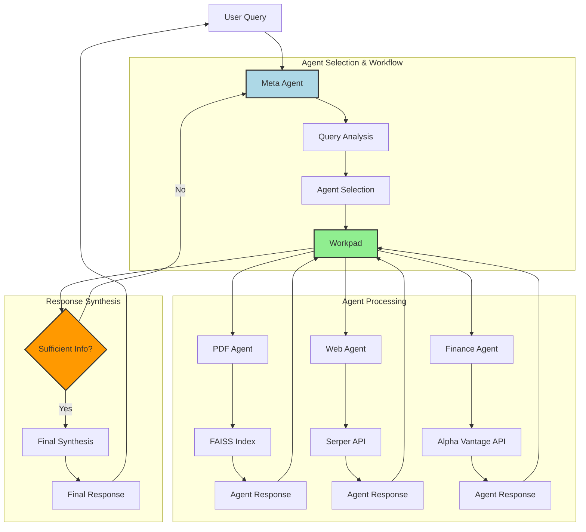

# Expert Financial Advisory System with Multi-Agent Architecture


## Table of Contents
- [Overview](#overview)
- [System Architecture](#system-architecture)
- [Features](#features)
- [Installation](#installation)
- [Configuration](#configuration)
- [Usage](#usage)
- [Example Queries](#example-queries)
- [Common Issues](#common-issues-and-best-practices)
- [Contributing](#contributing)

## System Architecture


The system follows a sophisticated workflow:

1. **Query Processing**
   - User query is received by MetaAgent
   - MetaAgent analyzes query and selects appropriate agents
   - Selected agents are registered in Workpad

2. **Agent Execution**
   - Each selected agent processes the query using its specialized tools:
     - PDF Agent: FAISS vector store
     - Web Agent: Serper API
     - Finance Agent: Alpha Vantage API
   - Agent responses are written to Workpad

3. **Synthesis Loop**
   - MetaAgent checks if gathered information is sufficient
   - If YES: Proceeds to final synthesis
   - If NO: Returns to agent selection for additional information
   - Process repeats until sufficient information is gathered

4. **Response Generation**
   - Final synthesis combines all agent responses
   - Coherent response delivered to user

# Expert Agent System

A robust, end-to-end solution for building domain-specific expert systems using LLaMA 3.2 90B or 3B locally via Ollama. The pdf knowledge base and web agent are limited in scope and can easily be expanded.

## Overview

This repository serves as an educational foundation for those looking to understand and build sophisticated agent-based systems. The codebase is deliberately designed to be:

- **Modular**: Easy to extend and modify
- **Generalisable**: Adaptable to any domain or purpose
- **Educational**: Well-documented and easy to understand

## Part of a Larger Series

This is the first in a 4-part series exploring RAG (Retrieval-Augmented Generation) agents:

1. **Basic Expert System** (This Repo)  
   A clean, accessible implementation focusing on core concepts

2. **Knowledge Graph Enhanced** (Coming Soon)  
   Adding sophisticated node relationship pattern matching

3. **Interactive Interface** (Coming Soon)  
   Implementing a Chainlit frontend for a more engaging chat experience

4. **Advanced Features** (Coming Soon)  
   Stay tuned!

## Getting Started

The system is powered by LLaMA 3.2 90B via Groq or 3B locally via Ollama, offering state-of-the-art language model capabilities while maintaining a straightforward implementation.
Compare both answers and you'll see the 90B model is faster even over an API than the 3B local model using ollama with far better answers, particularly in knowledge synthesis and staying true to the source material. We can empirically show this and therefore state knowledge synthesis is an advanced functionality and small local models arent quite up to the task yet, but are getting very close!

---

## What Is This Repository?

This project provides a framework for an AI-driven financial advisory system that combines three specialized agents:

1. **PDF Agent (Knowledge Base)**
   - Processes financial documents, research papers, and trading guides
   - Provides educational content and strategic advice
   - Uses FAISS for efficient document retrieval

2. **Web Agent (Real-Time Intelligence)**
   - Gathers current market news and analyst opinions
   - Tracks industry trends and developments
   - Provides real-time context for decision-making

3. **Finance Agent (Market Data)**
   - Monitors live stock prices and market metrics
   - Analyzes financial ratios and performance indicators
   - Tracks market movements and trading volumes

The system excels at:
- Synthesizing information from multiple sources
- Providing context-aware financial advice
- Combining historical knowledge with real-time data
- Offering educational content alongside market analysis

By leveraging both local processing (LLaMA 3.2) and strategic API integrations (Serper, Alpha Vantage), this system provides comprehensive financial insights while maintaining data privacy and cost efficiency.

---

## Features

- **Multi-Agent Architecture**
  - PDF Agent for knowledge base and educational content
  - Web Agent for real-time market intelligence
  - Finance Agent for live market data analysis
  - Smart agent selection based on query context

- **Advanced RAG Implementation**
  - PDF-to-Text Processing with intelligent chunking
  - FAISS indexing for efficient document retrieval
  - Context-aware document synthesis
  - Seamless integration of multiple knowledge sources

- **Real-Time Market Intelligence**
  - Live web scraping for current market news
  - Real-time stock data and metrics
  - Analyst sentiment tracking
  - Industry trend analysis

- **LLaMA 3.2 Integration**
  - Local inference via Ollama
  - Context-aware response generation
  - Natural language understanding
  - Efficient prompt handling

- **Privacy and Security**
  - Local-first design for sensitive data
  - Controlled API usage
  - Secure document processing
  - Private knowledge base management

- **Interactive Experience**
  - Real-time terminal interface
  - Natural language querying
  - Multi-agent response synthesis
  - Comprehensive financial analysis

---

## Why Use This?

This repository is an excellent starting point for building AI applications tailored to **domain-specific tasks**. It showcases how to:

- Create a **personal knowledge base** from static PDFs.
- Use LLaMA 3.2 as a cost-efficient and open-source alternative to larger, closed models.
- Build tools for **educational, research, or enterprise needs**, such as:
  - Financial advising.
  - Research assistance.
  - Technical documentation search and summarization.

---

## Extensibility

While the repository is simple and functional, it’s built to be highly extensible:

- **API Integrations**: Add tools like Yahoo Finance for live financial data or calculators for advanced queries.
- **Custom Knowledge Bases**: Easily expand your knowledge base by adding more PDFs or domain-specific content.
- **Enhanced Retrieval**: Integrate additional vector stores or retrieval algorithms to optimize performance for larger datasets.

---

## Who Is This For?

This repository is ideal for:

- Developers seeking to experiment with **RAG-based systems**.
- Enterprises needing **secure, local AI solutions** tailored to their data.
- Researchers and educators who want **AI-enhanced knowledge management**.

---

## Why LLaMA 3.2 and Ollama?

Meta’s **LLaMA 3.2** represents the forefront of open-source AI, offering high performance in a compact, efficient model. By integrating it with **Ollama**, this project provides:

- **Local inference**: No reliance on cloud-based solutions.
- **Democratized AI**: Accessible for developers of all scales—not just big tech companies.
- **Efficiency**: Ideal for creating powerful, domain-specific tools without requiring massive computational resources.

---

This repository is your gateway to exploring RAG systems, creating domain-specific LLMs, and building local AI-powered tools that prioritize efficiency, privacy, and customization. Start with the provided tutorial and expand as needed to fit your unique use case!

---

## Prerequisites

- Python 3.11 or later
- Ollama installed on your machine
- Required Python packages (see Installation section)

## Installation

1. Clone this repository:

    ```bash
    mkdir Expert-Agent
    git clone git@github.com:cookieclicker123/Expert-Agent.git
    cd Expert-Agent
    ```

2. Install the required Python packages:

    ```bash
    pip install -r requirements.txt
    ```

3. Install Ollama from [official Ollama website](https://ollama.com/).

4. Pull the LLaMA 3.2 model using Ollama:

    ```bash
    ollama pull llama3.2
    ```

## Make .env file for API Keys

### Alpha Vantage API (Financial Data)
1. Visit https://www.alphavantage.co/support/#api-key
2. Sign up for a free account
3. Navigate to your Dashboard
4. Copy your API key

Note: Rate limits on free accounts are low (25 requests per day). Consider a paid account if you plan on using this tool heavily.

### Serper API (Web Search)
1. Visit https://serper.dev/
2. Sign up for an account
3. Navigate to Dashboard
4. Copy your API key

Note: Serper offers 2,500 free searches when you sign up, which is generally sufficient for testing and personal use. For production environments, consider their paid plans for higher limits.

### llama3.2 90B text preview model
1. sign up to groq
2. go to https://console.groq.com/keys
3. create a new key
4. copy the key

Note: this 90B model is substantially better than the 3B model. When you run the `main.py` script, it will ask you which model to use. Choose the 90B model if you want better performance. Choose the 3B model if you want to use a truly local, private model where all you data stays on your machine. Surprisingly though, Groq is so quick that the 90B model is faster even over an API than the 3B local model using ollama!.

Create a `.env` file in the root folder and add your API keys:

```bash
ALPHA_VANTAGE_API_KEY=<your_vantage_api_key>
SERPER_API_KEY=<your_serper_api_key>
GROQ_API_KEY=<your_groq_api_key>
```

## PDF to Text Conversion

To convert your PDFs into text files, run the `pdf_to_text.py` script. Make sure your PDF files are placed in the `Data/` folder.

Usage:

```bash
python scripts/pdf_to_json.py
```

This will convert all PDF files in the `Data/` folder and store the text files in the `DataTxt/` folder.

## Creating the FAISS Index

Run the `txt_to_index.py` script to generate the FAISS index from the text files in the `DataTxt/` folder.

Usage:

```bash
python scripts/json_to_index.py
```

This will create a FAISS index and save it in the `DataIndex/` folder.

## Running the LLaMA 3.2 3B Model with Ollama

To use the LLaMA 3.2 model for question answering, you need to run Ollama with the LLaMA model. You can either directly run:

```bash
ollama run llama3.2
```

Or create a `.bat` file for easier usage in VS Code if you use Windows instead of MacOS:

1. Create a `ollama.bat` file in the root folder with the following content:

    ```bash
    @echo off
    "C:\path\to\Ollama\ollama.exe" %*
    ```

2. Replace the path with your Ollama installation path.

3. Now you can run the model with:

    ```bash
    .\ollama.bat run llama3.2
    ```

## Running the RAG System

The main script for running the RAG-based question-answering system is `main.py`. This script retrieves relevant documents using the FAISS index and generates answers using LLaMA 3.2.

Usage:

```bash
python main.py
```

The system will prompt you to ask a question. You can type your questions in the terminal and get answers based on the documents in the FAISS index. To exit, type `exit`.

## Example Queries

### PDF Agent (Knowledge Base)
Basic:
- "What is options trading?"
- "Explain the basics of technical analysis"
- "What are the fundamental principles of investing?"

Advanced:
- "Give me a detailed options trading strategy for volatile markets"
- "What are the key considerations for risk management in trading?"
- "Explain advanced chart pattern recognition techniques"

### Web Agent (Current Events)
Basic:
- "What's happening with chip shortages?"
- "Latest news about AI developments"
- "Current market trends in tech sector"

Advanced:
- "How are global supply chain issues affecting semiconductor industry?"
- "What are analysts saying about the impact of AI on cloud computing?"
- "Recent developments in quantum computing and their market impact"

### Finance Agent (Market Data)
Basic:
- "What's (AAPL) current price?"
- "Show me (NVDA) performance today"
- "Get Microsoft's market cap (MSFT)"

Advanced:
- "Compare (AAPL) and (MSFT) current metrics"
- "Analyze (AMD) trading volume patterns"
- "Show (TSLA) key financial ratios"

### Multi-Agent Queries
Knowledge + Current Events:
- "How do current chip shortages compare to historical semiconductor cycles?"
- "Explain options trading strategies considering today's market volatility"
- "What are the implications of recent AI developments for traditional trading strategies?"

Market Data + News:
- "Why is (NVDA) stock moving today?"
- "Analyze (AAPL)'s performance with recent supply chain news"
- "How are analyst ratings affecting (MSFT)'s price?"

Comprehensive Analysis:
- "Give me a complete analysis of the AI chip market, including (NVDA), (AMD), and (INTC)"
- "Analyze the impact of current market conditions on options trading strategies"
- "What's driving the semiconductor sector this week? Include historical context and current data"

### Notes:
- Finance agent queries require Alpha Vantage API key
- Web queries provide real-time information
- PDF/Knowledge base responses depend on available documents
- Multi-agent queries demonstrate system's synthesis capabilities

## Common Issues and Best Practices

- **Incompatible Embeddings**: Ensure that the same embeddings model is used when creating and loading the FAISS index.
- **Model Version Issues**: Make sure you're using the correct version of LLaMA (e.g., `llama3.2`) as specified.
- **Prompt Crafting**: Use precise and context-specific prompts to get better responses from the model.
- **Memory Leaks**: Monitor system resources during extended use to prevent memory issues.
- **Reuse Models**: Avoid reloading or re-initializing the model unnecessarily to improve performance.

## Contributing

Contributions are welcome! Please feel free to submit a Pull Request. For major changes, please open an issue first to discuss what you would like to change.

## License

This project is licensed under the MIT License - see the [LICENSE](LICENSE) file for details.

## Acknowledgments

- Meta AI for LLaMA 3.2
- Ollama team for local model serving
- Groq for high-performance inference
- FAISS team for vector indexing
