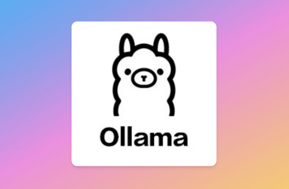

# RAG-Based Application with LLaMA 3.2 and Ollama



This repository demonstrates a **Retrieval-Augmented Generation (RAG)** application built using **LLaMA 3.2** via **Ollama**. It combines efficient document retrieval with the power of a lightweight, open-source language model to create a **context-aware, local AI system**. The application is specifically designed to work offline, turning static PDFs into a dynamic knowledge base capable of answering real-world questions.

---

## What Is This Repository?

This project provides a framework to transform collections of documents into a **powerful, AI-driven retrieval system**. Using a combination of LLaMA 3.2's generative capabilities and FAISS for document indexing, this repository empowers users to:

- **Query any set of documents** in real time.
- Retrieve and generate detailed, contextually relevant answers from your knowledge base.
- Build specialized applications for domain-specific knowledge, like financial advising, research assistance, or enterprise AI tools.

By leveraging Meta’s open-source LLaMA 3.2 model, this repository democratizes AI for **developers, researchers, and enterprises**, enabling local, secure, and cost-effective solutions without relying on large proprietary systems or internet connectivity.

---

## Features

- **PDF-to-Text Processing**: Converts PDF documents into text for seamless integration into the retrieval system.
- **Efficient Document Indexing**: Uses **FAISS** to create a robust index for fast and accurate document retrieval.
- **LLaMA 3.2 Integration**: Employs the lightweight LLaMA 3.2 model via **Ollama**, allowing for **context-aware question answering** based on retrieved content.
- **Real-Time Querying**: Enables users to interact directly with the system via the terminal, making it ideal for offline scenarios.
- **Local-First Design**: All processing is done locally, ensuring privacy and security.

---

## Why Use This?

This repository is an excellent starting point for building AI applications tailored to **domain-specific tasks**. It showcases how to:

- Create a **personal knowledge base** from static PDFs.
- Use LLaMA 3.2 as a cost-efficient and open-source alternative to larger, closed models.
- Build tools for **educational, research, or enterprise needs**, such as:
  - Financial advising.
  - Research assistance.
  - Technical documentation search and summarization.

---

## Extensibility

While the repository is simple and functional, it’s built to be highly extensible:

- **API Integrations**: Add tools like Yahoo Finance for live financial data or calculators for advanced queries.
- **Custom Knowledge Bases**: Easily expand your knowledge base by adding more PDFs or domain-specific content.
- **Enhanced Retrieval**: Integrate additional vector stores or retrieval algorithms to optimize performance for larger datasets.

---

## Who Is This For?

This repository is ideal for:

- Developers seeking to experiment with **RAG-based systems**.
- Enterprises needing **secure, local AI solutions** tailored to their data.
- Researchers and educators who want **AI-enhanced knowledge management**.

---

## Why LLaMA 3.2 and Ollama?

Meta’s **LLaMA 3.2** represents the forefront of open-source AI, offering high performance in a compact, efficient model. By integrating it with **Ollama**, this project provides:

- **Local inference**: No reliance on cloud-based solutions.
- **Democratized AI**: Accessible for developers of all scales—not just big tech companies.
- **Efficiency**: Ideal for creating powerful, domain-specific tools without requiring massive computational resources.

---

This repository is your gateway to exploring RAG systems, creating domain-specific LLMs, and building local AI-powered tools that prioritize efficiency, privacy, and customization. Start with the provided tutorial and expand as needed to fit your unique use case!

---

## Prerequisites

- Python 3.11 or later
- Ollama installed on your machine
- Required Python packages (see Installation section)

## Installation

1. Clone this repository:

    ```bash
    mkdir Expert-Agent
    git clone git@github.com:cookieclicker123/Expert-Agent.git
    cd Expert-Agent
    ```

2. Install the required Python packages:

    ```bash
    pip install -r requirements.txt
    ```

3. Install Ollama from [official Ollama website](https://ollama.com/).

4. Pull the LLaMA 3.2 model using Ollama:

    ```bash
    ollama pull llama3.2
    ```

## Make .env file for API Keys

### Alpha Vantage API (Financial Data)
1. Visit https://www.alphavantage.co/support/#api-key
2. Sign up for a free account
3. Navigate to your Dashboard
4. Copy your API key

Note: Rate limits on free accounts are low (25 requests per day). Consider a paid account if you plan on using this tool heavily.

### Serper API (Web Search)
1. Visit https://serper.dev/
2. Sign up for an account
3. Navigate to Dashboard
4. Copy your API key

Note: Serper offers 2,500 free searches when you sign up, which is generally sufficient for testing and personal use. For production environments, consider their paid plans for higher limits.

Create a `.env` file in the root folder and add your API keys:

```bash
ALPHA_VANTAGE_API_KEY=<your_vantage_api_key>
SERPER_API_KEY=<your_serper_api_key>
```

## PDF to Text Conversion

To convert your PDFs into text files, run the `pdf_to_text.py` script. Make sure your PDF files are placed in the `Data/` folder.

Usage:

```bash
python pdf_to_txt.py
```

This will convert all PDF files in the `Data/` folder and store the text files in the `DataTxt/` folder.

## Creating the FAISS Index

Run the `txt_to_index.py` script to generate the FAISS index from the text files in the `DataTxt/` folder.

Usage:

```bash
python txt_to_index.py
```

This will create a FAISS index and save it in the `DataIndex/` folder.

## Running the LLaMA 3.2 Model with Ollama

To use the LLaMA 3.2 model for question answering, you need to run Ollama with the LLaMA model. You can either directly run:

```bash
ollama run llama3.2
```

Or create a `.bat` file for easier usage in VS Code if you use Windows instead of MacOS:

1. Create a `ollama.bat` file in the root folder with the following content:

    ```bash
    @echo off
    "C:\path\to\Ollama\ollama.exe" %*
    ```

2. Replace the path with your Ollama installation path.

3. Now you can run the model with:

    ```bash
    .\ollama.bat run llama3.2
    ```

## Running the RAG System

The main script for running the RAG-based question-answering system is `main.py`. This script retrieves relevant documents using the FAISS index and generates answers using LLaMA 3.2.

Usage:

```bash
python main.py
```

The system will prompt you to ask a question. You can type your questions in the terminal and get answers based on the documents in the FAISS index. To exit, type `exit`.

## Example Queries

### PDF Agent (Knowledge Base)
Basic:
- "What is options trading?"
- "Explain the basics of technical analysis"
- "What are the fundamental principles of investing?"

Advanced:
- "Give me a detailed options trading strategy for volatile markets"
- "What are the key considerations for risk management in trading?"
- "Explain advanced chart pattern recognition techniques"

### Web Agent (Current Events)
Basic:
- "What's happening with chip shortages?"
- "Latest news about AI developments"
- "Current market trends in tech sector"

Advanced:
- "How are global supply chain issues affecting semiconductor industry?"
- "What are analysts saying about the impact of AI on cloud computing?"
- "Recent developments in quantum computing and their market impact"

### Finance Agent (Market Data)
Basic:
- "What's AAPL's current price?"
- "Show me NVDA's performance today"
- "Get Microsoft's market cap"

Advanced:
- "Compare AAPL and MSFT's current metrics"
- "Analyze AMD's trading volume patterns"
- "Show Tesla's key financial ratios"

### Multi-Agent Queries
Knowledge + Current Events:
- "How do current chip shortages compare to historical semiconductor cycles?"
- "Explain options trading strategies considering today's market volatility"
- "What are the implications of recent AI developments for traditional trading strategies?"

Market Data + News:
- "Why is NVDA stock moving today?"
- "Analyze AAPL's performance with recent supply chain news"
- "How are analyst ratings affecting MSFT's price?"

Comprehensive Analysis:
- "Give me a complete analysis of the AI chip market, including NVDA, AMD, and INTC"
- "Analyze the impact of current market conditions on options trading strategies"
- "What's driving the semiconductor sector this week? Include historical context and current data"

### Notes:
- Finance agent queries require Alpha Vantage API key
- Web queries provide real-time information
- PDF/Knowledge base responses depend on available documents
- Multi-agent queries demonstrate system's synthesis capabilities

## Common Issues and Best Practices

- **Incompatible Embeddings**: Ensure that the same embeddings model is used when creating and loading the FAISS index.
- **Model Version Issues**: Make sure you're using the correct version of LLaMA (e.g., `llama3.2`) as specified.
- **Prompt Crafting**: Use precise and context-specific prompts to get better responses from the model.
- **Memory Leaks**: Monitor system resources during extended use to prevent memory issues.
- **Reuse Models**: Avoid reloading or re-initializing the model unnecessarily to improve performance.
